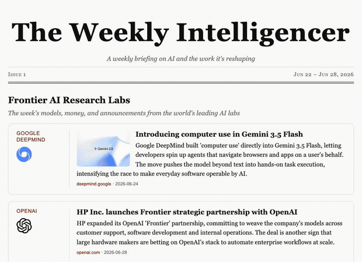

# The Weekly Intelligencer

**A weekly digest of AI industry news, featuring updates on frontier labs, AI's rollout across industry, and the latest trending AI-generated images and video.**

## Preview



## Dimensions
Currently tracked AI research labs, industrial AI adoption, and social media platforms.  
**Frontier AI Research Labs**

| AI Lab | Search type | Description |
|---|---|---|
| Anthropic | `site` | Official newsroom |
| Google DeepMind | `feed` | Official RSS |
| OpenAI | `feed` | Official RSS |
| xAI | `site` | Official newsroom |
| DeepSeek | `feed` | Google News |
| Meta | `site` | Official AI blog |
| Alibaba Qwen | `feed` | Google News |

**The Intelligent Factory**

Frontier AI landing in industry — a named manufacturer adopting a named AI vendor's technology for its own operations (e.g. HP × OpenAI's "Frontier" partnership), found fresh each week via `search` and checked against a qualify/reject bar: a real deal, deployment, or disclosed result, not a hardware/infrastructure story or an unnamed "AI-powered" claim. No fixed roster — any qualifying company counts — but a watchlist sharpens the weekly search. A sample:

| Company | Search type | Sector |
|---|---|---|
| HP | `search` | Electronics/hardware |
| Foxconn | `search` | Electronics/hardware |
| Siemens | `search` | Industrial/automation |
| ABB | `search` | Industrial/automation |
| Schneider Electric | `search` | Industrial/automation |
| Toyota | `search` | Automotive |
| Hyundai | `search` | Automotive |
| Caterpillar | `search` | Heavy industry |
| Boeing | `search` | Aerospace |
| Unilever | `search` | Consumer goods |

**Trending Social Video & Images**

| Social media | Search type | Description |
|---|---|---|
| YouTube Shorts | `youtube` | Official Youtube shorts |
| TikTok | `search` | Web Search |
| Instagram | `search` | Web Search |
| Facebook | `search` | Web Search |


## Quick Start

```bash
git clone https://github.com/kqiu10/the-weekly-intelligencer.git
cd the-weekly-intelligencer
uv sync
```

<details open>
<summary><b>As a Claude Code skill (full issue)</b></summary>
Run that prompt in Claude Code from the project directory. 

```
generate this week's Intelligencer issue
```
</details>

<details>
<summary><b>By hand (deterministic only, zero tokens)</b></summary>

```bash
uv run intelligencer validate                 # check config/dimensions.yaml
uv run intelligencer fetch                    # feeds + sites + YouTube → out/manifest.json
uv run intelligencer fetch --date 2026-06-28  # …or pin a specific past week
uv run intelligencer trends                   # fold heat into data/trends.json
uv run intelligencer render --open            # manifest → dist/<date>.html
```

`--only <name>` narrows fetch/render to one dimension. With an all-`feed` + all-`raw` config this produces a complete issue with **zero** Claude tokens.
</details>

---


## Trending

The social-video dimension tracks which AI-generated **contexts** are heating up week over week. `data/trends.json` is a small, committed time-series — one topic per canonical context (`id`, `descriptor`, `tags`, and a weekly `magnitude` history). `intelligencer trends` folds each week's magnitudes in and computes a `heat_tier` (0–3): a context that is **recurring _and_ rising** earns heat.

That heat is stamped onto the individual posts a topic points to (its `samples`), and a **flame renders after that card's title** — only when the card is actually hot. A brand-new or cooling context shows nothing; it needs ≥2 weeks of rising magnitude to light up.

---

## Output

A self-contained `dist/<date>.html` with the styling inlined and its images/logos alongside in `dist/assets/`. The bundle is portable — open it locally or host the folder anywhere. The masthead range is week-to-date and fully deterministic (derived from the issue date, no wall-clock).


## Why Agent Skills

Most AI news tools force a choice: paraphrase everything through an LLM (expensive, hallucination-prone) or just dump raw feeds (no editorial judgment). Building this as a Claude Code **Agent Skill** splits the difference — **deterministic scripts do the fetching for free**, and the skill hands Claude Code only the part that needs judgment: writing summaries and curating trends, done **in-session, with no API key**. The output is a **single portable HTML file**, not a service to host, and the whole run is reproducible from the manifest.

## Issues

| Issue | Date | Link |
|---|---|---|
| Issue 1 | 6/22-6/28 | [`Issue 1`](https://kqiu10.github.io/the-weekly-intelligencer/issues/2026-06-28.html) |
| Issue 2 | 6/29-7/3 | [`Issue 2`](https://kqiu10.github.io/the-weekly-intelligencer/issues/2026-07-03.html) |

## License

MIT — see [LICENSE](LICENSE).
